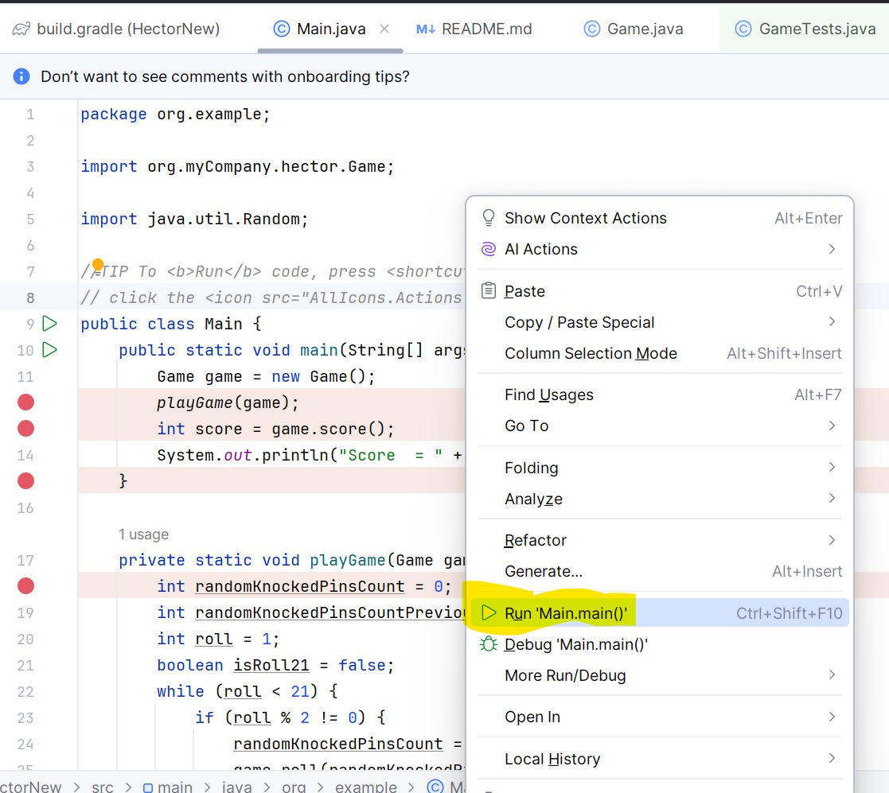
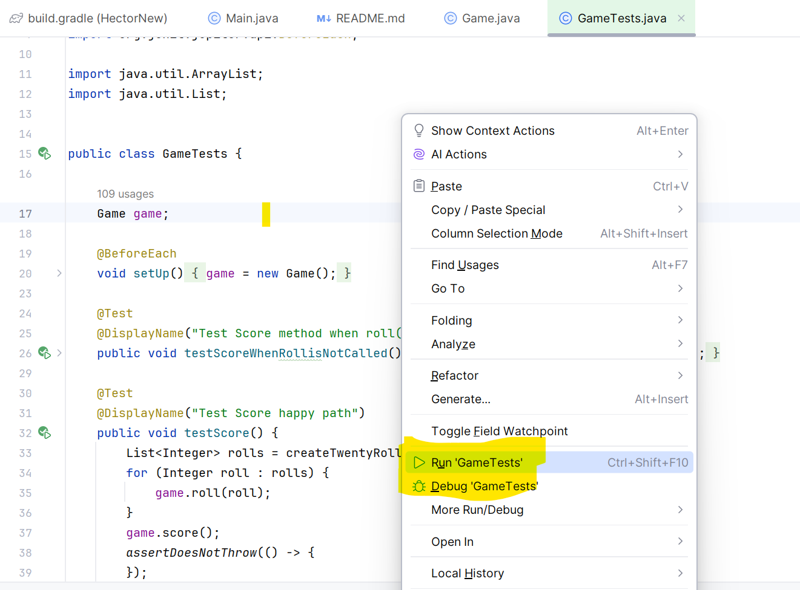

BOWLING SCORE:

This application is give score for Bowling game.

Requirement:

- The game consists of 10 frames. In each frame the player has
two opportunities to knock down 10 pins. The score for the frame is the total
number of pins knocked down, plus bonuses for strikes and spares.
- A spare is when the player knocks down all 10 pins in two tries. The bonus for
  that frame is the number of pins knocked down by the next roll.
- A strike is when the player knocks down all 10 pins on his first try. The bonus
  for that frame is the value of the next two balls rolled.
- In the tenth frame a player who rolls a spare or strike is allowed to roll the extra
  balls to complete the frame. However, no more than three balls can be rolled in
  tenth frame.

Based on above requirments this application calculates score.

Dependencies:
 
- Java 1.17
- Junit 5.10

Running the Application:

We have two options to run this application.

1. Run using main method.
2. Run using Junit class.

Running using main method:

- Go to the below path
  org/example/Main.java
- Select Run/Debug options as per the below from the Run option on the menu.

This score will be based on arbitrary score auto generated based on conditions below
- Score should be between 0-10.
- If in a Frame if the first try is 10 then it should be treated as Strike.
- If the total of 2 tries in a frame is 10 it should be treated as Spare.
- If the last frame is Strike or Spare extra try should be given but, not more than 3 tries are possible in the last frame.

Running using Junit class:

- Please go the below path
  org/myCompany/hector/GameTests.java
- Right click on the file as per below screenshot and select Run option to run all the run test classes.

 